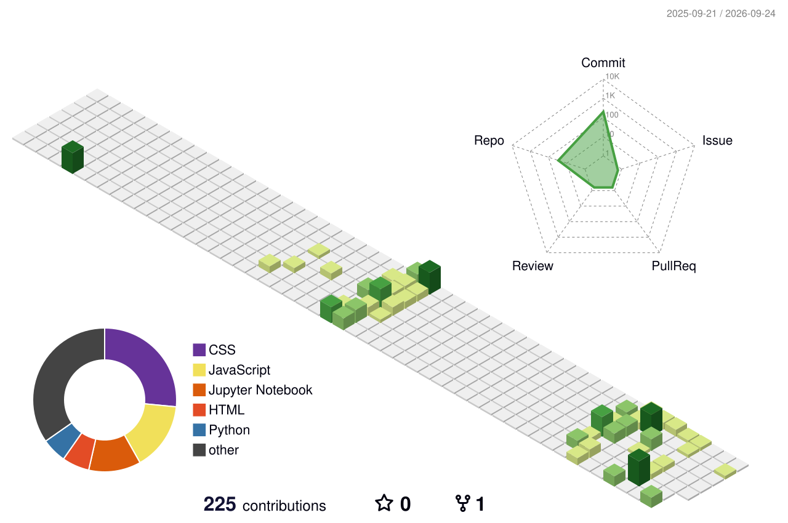

<h1 align="center">🚀 Hey, I'm Abinash</h1>
<h3 align="center">⚡ Building Ideas into Reality | Future AI Engineer | FullStack Developer</h3>

  

---

## 🧠 About Me
- 🔥 Passionate about building **real-world projects**
- 🌱 Currently diving deep into **AI, Machine Learning & Web Development**
- 💡 Love solving problems & creating impactful solutions
- 🎯 Goal: Become a **Top AI Developer in 6 months..**

---

## 🌐 Live Project
🚀 My To-Do App:  
👉 https://abinash-6370.github.io/To_Do_List/

🚀 My Portfolio:
👉https://oab-portfolio.netlify.app/

🚀Attendance_Calculator:
👉https://attendance-iq.netlify.app/

🚀Mental Health Score Predictor:
👉https://mental-health-score-predict-d97k.onrender.com/

---

## 🛠️ Tech Stack

  

  

---
## 📈 Contribution Graph

  

<!--   -->

<h2>
  
  
  Github Stats :
</h2>

## ⚡ Current Focus
- 🤖 AI + ML Projects
- 🌍 Real-world problem solving apps
- 🚀 Building startup-level ideas

---

## 📬 Let's Connect

  
  

  

  

  

  

---

  ⭐ "Code. Learn. Build. Repeat." ⭐

<!-- ## 🔥 GitHub Streak

  

 -->
